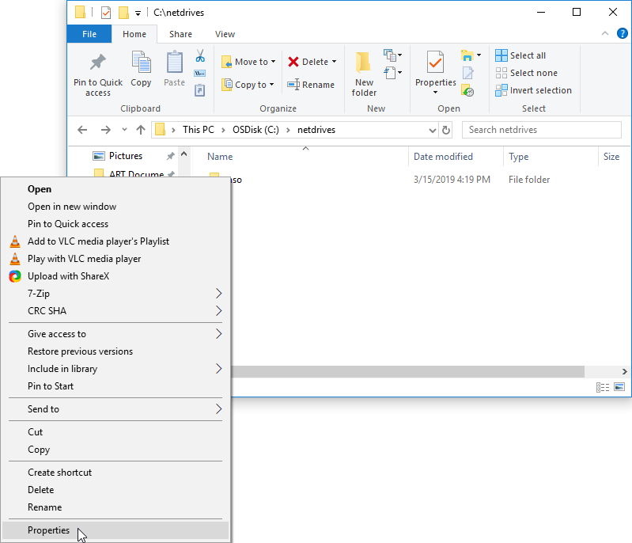
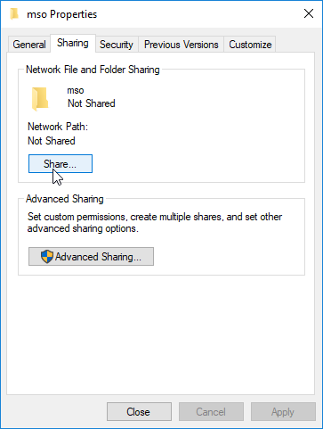
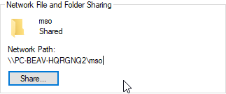
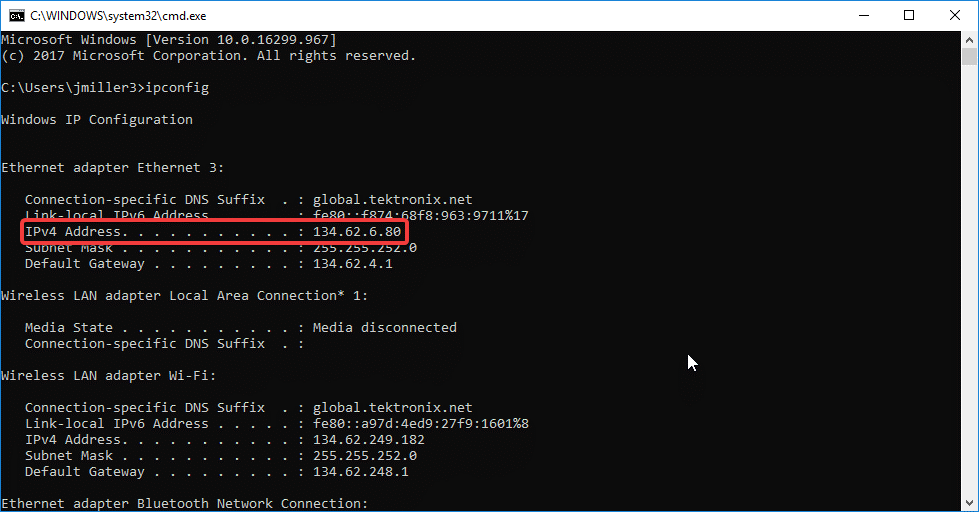
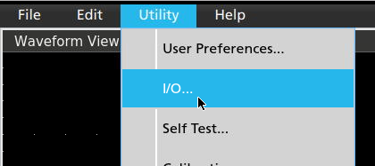
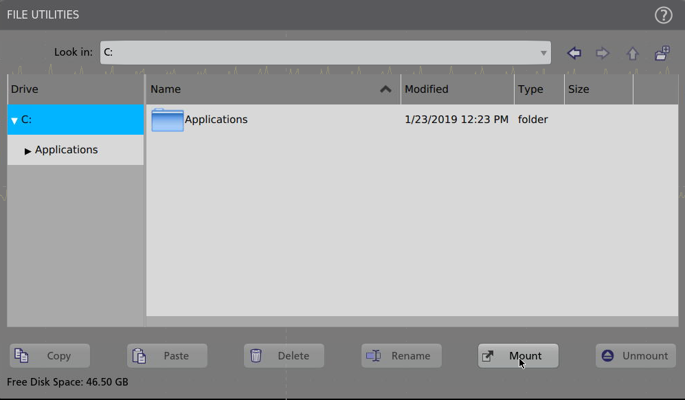
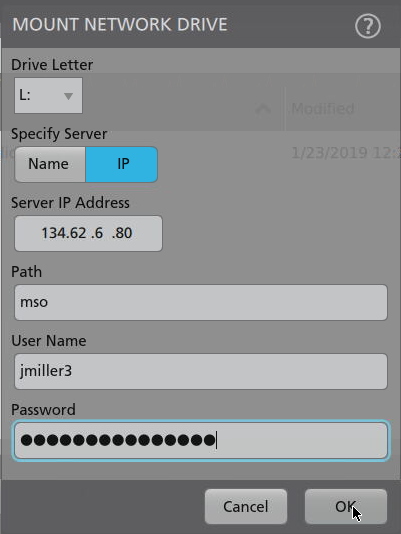
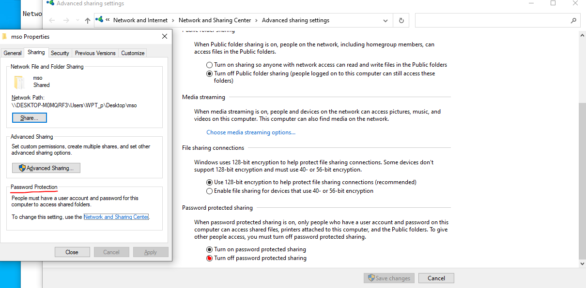
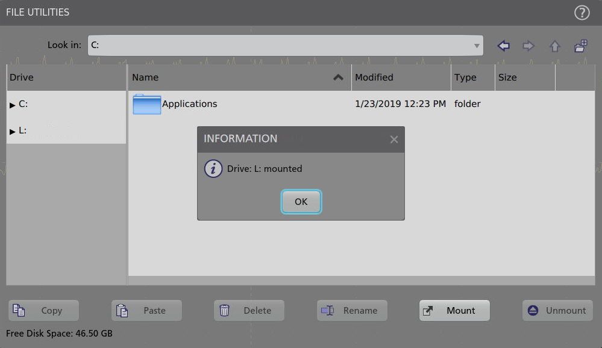
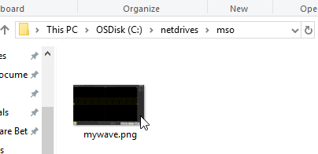

## Introduction ##

Network drives were introduced in firmware version 1.8.7 for 5 Series, 5 Series Low Profile, and 6 Series MSOs.  This feature allows you to specify a directory on another computer for the scope to use as storage.  To access this storage, or network drive, the scope must be on the same network as the host computer.  A network drive can simplify exporting data and images from the scope, importing setups and reference waveforms, and enable the scope as a shared workspace among members of a team.

### Procedure ###

1) Connect the scope and host computer with an ethernet cable.
2) Enable sharing on the host computer.  On a Windows PC, simply choose or create a folder and right) click it, then open Properties.
	- 
	- In this example, C:\netdrives\mso\ will be shared as a network drive.

3) In the Properties screen, navigate to the Sharing tab and click the Share button.
	- 

4) Add the users that will have access to the network drive to this network, set their permission levels, then click the Share button, then click Done in the next window.  This directory is now accessible from connected network locations.  Note the Network Path provided for this folder.
	- 
5) Note the IP address of the host computer.  In Windows, the quickest way to do this is to use the command prompt.  Press Windows Key + R to open the run menu, then type cmd and click run to run the command prompt.
6) Type “ipconfig” into the console and press Enter.  The host computer’s network information will be displayed.  Note the IPv4 Address of your primary network adapter.
	- 
7) Ensure that the scope is connected to the network.  Navigate to Utility->I/O and check that the scope has a valid IP address.  If the scope and host computer are connected to a LAN, they should share a portion of their IP addresses.
	- 
8) Navigate to the File->File Utilities menu and click the Mount button.
	- 
9) Choose what drive letter to use for the network drive.  This selection does not matter other than for personal organization.
10) Choose whether to identify the host computer by Name or IP.  This example will use IP.  Enter the IP address identified in Step 6.
11) Enter the network path FOLLOWING the host computer’s name from the Network Path identified in step 4.  For instance, if the network path is “\\PC-BEAV-HQRGNQ2\mso”, then the Path should be set to “mso”.  This field does not require any preceding slashes, colons, or drive letters, even if a hostname is used instead of an IP address.
12) Enter a valid User Name and Password for a user that has access to the shared drive.  Click OK to mount the drive.
	- 
13) If the user, password or domain/workgroup results in an error you can try couple of things in host computer side.
	- The domain/group should be "WORKGROUP"
	- Be sure that user is selected to be shared with. Note that this user should be a user with a valid password in the host computer and should have the access to the shared folder.
	- 
	- If the user cannot be created, the password protection can be disabled.
	- 

14) The network drive is now available for use!  The drive will now appear in the list of drives available for the scope and can be used for any file saving or loading operations, including those executed via programmatic commands.
	-  

This FAQ Applies to:

Product Series: 4 Series B MSO Mixed Signal Oscilloscope 5 Series MSO Low Profile 5 Series B MSO 6 Series Low Profile Digitizer 6 Series B MSO

Product:

FAQ ID 773296

Adapted from: https://www.tek.com/en/support/faqs/how-do-i-set-network-drive-my-5-series-mso-or-6-series-mso

*Ozgur Gulsuna 2024*